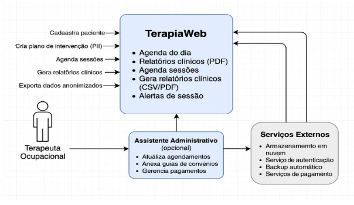

<h1>Visão do Produto</h1>

<h2>TerapiaWeb</h2>
<h2>TerapiaWeb</h2>

<small>Versão 1.0</small>
<small>Versão 1.0</small>

---

## Histórico de revisões

|    Data    | Versão |           Descrição           |      Autor       |
| :--------: | :----: | :---------------------------: | :--------------: |
| 25/05/2025 |  1.0   |     Criação do documento      | Joana Elise, Jonata Barbosa, Matheus Barbosa, Leidiana Nascimento |

# Introdução

O Documento de Visão do Produto (DVP) é um documento que descreve o produto de software que será desenvolvido. Ele descreve o problema que será resolvido, as principais necessidades dos stakeholders, as principais funcionalidades do sistema, as restrições do projeto, etc.

## Propósito

Oferecer um sistema completo que facilite o agendamento de consultas, envie lembretes automáticos para cada sessão ou encontro e disponibilize procedimentos padrão personalizados para cada cliente.

## Definições e abreviações

### Abreviações

| Termo | Definição                                    |
| :---: | -------------------------------------------- |
|  DVP  | Documento de Visão do Produto                |
|  TO   | Terapeuta Ocupacional                        |
|CREFITO| Conselho Regional de Fisioterapia e Terapia Ocupacional                                            |
| LGPD  | Lei Geral de Proteção de Dados               |
| PII   | Plano de Intervenção Individualizado         |
| INSS  | Instituto Nacional do Seguro Social         |
|  COPM | Medida Canadense de Desempenho Ocupacional                                            |
|  MOHO   | Modelo de Ocupação Humana                  |

### Definições

|    Termo    | Definição                                                                                                                       |
| :---------: | ------------------------------------------------------------------------------------------------------------------------------- |
|   Cliente   | É uma pessoa física ou jurídica que compra um produto ou contrata um serviço.                                                   |
| Terapeuta Ocupacional | É um profissional de saúde que se concentra em ajudar as pessoas a realizar atividades de vida diária, promover a autonomia e o bem-estar.                                                |
|   Consultório  | Local de trabalho onde certos profissionais dão consulta aos seus clientes.                                                             |
| Prontuário  | É um documento legal que todo paciente precisa ter para ser atendido.                                                      |
|  Anamnese   | Entrevista detalhada realizada por um profissional de saúde para coletar informações sobre a história clínica, estilo de vida, histórico familiar e outros fatores relevantes que possam influenciar a saúde do paciente. |
| Protocolos de avaliação | Documentos que estabelecem critérios para a avaliação de uma determinada condição de saúde, seja ela uma doença, um agravo ou um problema de saúde específico.                                                             |
|   Atestado   | É um documento formal emitido por um profissional de saúde que atesta a condição de saúde de um indivíduo.                                                                                  |
|   Serviço   | Exercício e desempenho de qualquer atividade.                                                                                             |
|   Paciente   | É a pessoa que necessita de cuidado individualizado, por um período curto, médio ou longo.                                                                                             |
|   Diagnóstico   | É o processo analítico de que se vale o especialista ao exame de uma doença ou de um quadro clínico, para chegar a uma conclusão.                                                                                             |
|   Teleatendimento   | É a prestação de serviços ou informações por meio de tecnologias de comunicação, geralmente telefones ou internet.                                                                                             |
|   Equipe multidisciplinar   | Grupo de pessoas com diferentes áreas de conhecimento e especialidades, que trabalham juntas para alcançar um objetivo comum, combinando suas habilidades e perspectivas.                                                                                             |
|   Materiais terapêuticos   | Ferramentas e procedimentos que auxiliam no processo de reabilitação física, emocional ou psicológica de um paciente.                                                                                             |
## Escopo do produto

O TerapiaWeb tem como objetivo tornar o atendimento do profissional de Terapia Ocupacional mais ágil e eficiente, ao mesmo tempo em que permite ao paciente acessar, com antecedência, todas as informações relacionadas às suas sessões ou encontros.

---

# Posicionamento

## Oportunidade de negócios
O sistema oferece um leque diversificado de oportunidades, refletindo a ampla atuação dos profissionais de Terapia Ocupacional (TO) nas mais diversas áreas, como saúde mental, saúde coletiva, hospitais e clínicas, instituições, reabilitação, esportes, entre outras.

## Descrição dos benefícios para os clientes e dos problemas resolvidos

| Benefícios                    | Problemas Resolvidos                                                    | Afetados                                   |
| ----------------------------- | ----------------------------------------------------------------------- | ------------------------------------------ |
| Facilidade de gerenciamento   | Dificuldade em gerenciar consultas e procedimentos padrões no atendimento | Profissionais de TO que vendem o serviço |
| Alertas personalizados        | Falta de notificação para as sessões e encontros                   | Clientes que compram o serviço; Profissionais de TO. |
| Melhor experiência do cliente | Falta do feedback do cliente                          | Clientes que compram o serviço; Profissionais de TO. |
| Redução do tempo de espera    | Dificuldade em encontrar informações de contato para acionar a garantia | Clientes que precisam acionar a garantia   |
| Economia de dinheiro          | Despesas desnecessárias com pessoal para gerir o controle de atendimento       | Profissionais de TO |

---

# Descrição dos stakeholders e dos usuários

Esta seção descreve os stakeholders e os usuários do **TerapiaWeb**.

## Stakeholders

Segue abaixo a lista de stakeholders.

| Stakeholder                            | Descrição                                                                                                                                               | Papel                                                           |
| -------------------------------------- | ------------------------------------------------------------------------------------------------------------------------------------------------------- | --------------------------------------------------------------- |
| Terapeutas Ocupacionais                              | Profissionais da área de saúde graduados em Terapia Ocupacional.                                            | Clientes e usuários do sistema                                             |
| Equipe de Desenvolvimento              | Profissionais responsáveis por desenvolver e manter o sistema TerapiaWeb.                                                                                          | Desenvolvedores                                                 |
| Gerente de Projeto                     | Profissional responsável por gerenciar o projeto e garantir que o sistema seja entregue dentro do prazo e orçamento definidos.                          | Gerente de Projeto                                              |
| Assistentes Administrativos (caso exista)                | Profissionais responsáveis pela organização da clínica e do gerenciamento das operações do sistema (cadastros, agendamentos, etc)..                                    | Fornecer suporte ao gerenciamento do sistema da clínica.              |
| Pacientes | Suas informações serão tratadas no sistema.  | Não usam o sistema diretamente, mas são impactados.          |
|CREFITO            | Órgão regional responsável por garantir que os profissionais da Terapia Ocupacional estejam em conformidade com as normas éticas e técnicas da profissão. | Não usa o sistema diretamente, mas exige que os documentos e laudos sigam a regulamentação profissional. |

## Usuários e atores

Segue tabela com os usuários e atores do sistema:

| Usuário                  | Descrição                                                                                                    | Responsabilidades                                                                                                                                                                                                                | Stakeholders                                                                                    |
| ------------------------ | ------------------------------------------------------------------------------------------------------------ | -------------------------------------------------------------------------------------------------------------------------------------------------------------------------------------------------------------------------------- | ----------------------------------------------------------------------------------------------- |
| Terapeuta Ocupacional                | Profissional responsável por usar o sistema. | Criar prontuários, registrar laudos.            | Equipe de Desenvolvimento, Gerente de Projeto, Departamento de Atendimento ao Cliente           |
| Assistente Administrativo (caso exista)  | Profissional responsável por auxiliar nas tarefas administrativas.            | Gerenciar agendamentos, digitalizar documentos. | TO, Equipe de Desenvolvimento, Gerente de Projeto |
| Assistente Administrativo (caso exista)  | Profissional responsável por auxiliar nas tarefas administrativas.            | Gerenciar agendamentos, digitalizar documentos. | TO, Equipe de Desenvolvimento, Gerente de Projeto |
| Administrador do Sistema | Profissional responsável por gerenciar e manter o sistema.                                                   | Gerenciar os usuários do sistema, realizar backup dos dados, atualizar o sistema e garantir o seu funcionamento adequado.                                                                                                        | Equipe de Desenvolvimento, Gerente de Projeto                                                   |

---

# Descrição do ambiente de uso

## Ambiente de uso
A seguir, são descritos alguns ambientes em que o sistema pode ser utilizado:

### Ambiente de Trabalho
- Consultórios particulares com estrutura básica (computador e internet doméstica).
- Atendimentos domiciliares com uso de notebook.

### Habilidades dos Usuários
- Formação superior em Terapia Ocupacional.
- Baixo domínio de sistemas digitais especializados.
- Experiência com ferramentas básicas como Word e Excel.
- Formação superior em Terapia Ocupacional.
- Baixo domínio de sistemas digitais especializados.
- Experiência com ferramentas básicas como Word e Excel.

### Riscos Identificados
- Sem o sistema: perda de dados, falhas de agendamento, sanções por não conformidade com a LGPD.
- Com o sistema (mal implementado): baixa adesão por dificuldade de uso, vazamento de dados.
- Sem o sistema: perda de dados, falhas de agendamento, sanções por não conformidade com a LGPD.
- Com o sistema (mal implementado): baixa adesão por dificuldade de uso, vazamento de dados.

### Qualidade Esperada
- Alta disponibilidade (24/7).
- Interface simples e intuitiva.
- Ausência de falhas críticas.
- Atualizações frequentes e suporte técnico.
- Alta disponibilidade (24/7).
- Interface simples e intuitiva.
- Ausência de falhas críticas.
- Atualizações frequentes e suporte técnico.

### O sistema TerapiaWeb será utilizado principalmente em:
- Consultórios particulares: Equipados com um notebook ou desktop com acesso à internet.
- Ambientes domiciliares: Utilização do sistema em notebooks ou tablets, com ou sem acesso à internet (funcionalidade offline parcial).
- Ambientes domiciliares: Utilização do sistema em notebooks ou tablets, com ou sem acesso à internet (funcionalidade offline parcial).
- Infraestrutura mínima necessária: Navegador web atualizado (Google Chrome, Firefox, Edge ou Safari), conexão estável com a internet para uso completo das funcionalidades.
- Condições de uso: Ambientes silenciosos, com tempo reservado para preenchimento de dados clínicos e administrativos, geralmente durante ou no término dos atendimentos ou ao final do expediente.

O uso será feito por profissionais com domínio básico de informática, sem necessidade de treinamento avançado. A interface deve priorizar clareza, simplicidade e foco nas principais tarefas do dia a dia.

| Item  | Descrição                                    |
| :---: | -------------------------------------------- |
|  Usuários | Terapeutas ocupacionais e assistentes administrativos (caso exista)               |
| Ambiente físico  | Consultórios particulares e ambientes domiciliares        |
|  Dispositivos | Notebooks e tablets com acesso à internet                     |
| Sistema operacional  | Windows e macOS / IOS e Android          |
| Navegadores suportados | Google Chrome, Mozilla Firefox, Microsoft Edge, Safari|
| Conectividade  | Conexão estável com a internet e/ou suporte parcial offline     |
|  Infraestrutura | Computador com navegador moderno; sistema hospedado em nuvem com backups automáticos           |
|  Condições de uso | Entre atendimentos ou ao final do expediente, em ambiente tranquilo com tempo limitado           |
|  Experiência esperada | Interface simples, intuitiva e rápida, com curva de aprendizado baixa          |
|  Acessibilidade | Suporte a navegação por teclado e mouse; responsividade limitada a tablets (modo paisagem)           |

## Requisitos de Tecnologia

### Ambiente de Execução
- Navegador web em notebooks (Windows/macOS).
- Compatibilidade com tablets (modo paisagem).
- Offline: funções básicas disponíveis sem internet.

### Infraestrutura
- Hospedagem em nuvem (AWS ou Google Cloud).
- Backup automatizado e redundante.
- Suporte a criptografia e autenticação segura.

### Tecnologias Sugeridas
- Frontend: React.js + Tailwind CSS
- Backend: Django (Python) ou Node.js (Express)
- Banco de Dados: PostgreSQL ou Firebase
- Armazenamento: AWS S3 ou Google Cloud Storage

### Diagrama de Contexto:

# Visão geral do produto

## Visão geral

O sistema TerapiaWeb é uma ferramenta de gestão para consultórios autônomos de terapia ocupacional. Ele permite que os profissionais gerenciem seus pacientes, registrem sessões e controlem informações importantes relacionadas aos atendimentos. O sistema auxilia na gestão documental, substituindo o armazenamento físico de prontuários, que podem ter documentos perdidos e de difícil recuperação. 

Além disso, resolve a dependência de agendas físicas ou ferramentas não especializadas, facilitando o gerenciamento ágil e centralizado de horários. O TerapiaWeb foi criado para ser acessado através de navegadores web em computadores (Windows/macOS), com suporte a PWA (Progressive Web App). A versão inicial priorizará notebooks, mas há a intenção de expansão para mobile posteriormente. Isso permite que os TOs acessem e controlem suas informações de qualquer lugar e a qualquer momento, mesmo com funcionalidades básicas (como visualização de agenda) sem conexão à internet.

A interação entre os dispositivos ocorre por meio de uma conexão de rede, geralmente a Internet. O servidor que hospeda o sistema TerapiaWeb se comunica com os dispositivos dos clientes por meio de solicitações e respostas, permitindo que o sistema exiba informações e interaja com o usuário.

Por fim, o sistema TerapiaWeb pode ser integrado com serviços externos, como armazenamento em nuvem, serviço de autenticação, backup automático e serviços para gerência de pagamento.

## Custo e venda

A decisão acerca da viabilidade econômica deste requisito para planejamento de custos e orçamento do projeto do sistema TerapiaWeb está em desenvolvimento.

## Licenciamento para SaaS

O produto TerapiaWeb poderá ser licenciado por meio de uma licença de uso do tipo SaaS, que será fornecida pela empresa desenvolvedora do software. O sistema ficará hospedado em uma plataforma na nuvem, eliminando a necessidade de downloads e instalações. 

A empresa pagará uma mensalidade correspondente ao número de usuários ou recursos que vai utilizar no software. Enquanto o provedor ou empresa desenvolvedora fica responsável por todas as funções de atualização, manutenção, disponibilidade e segurança.

O serviço é contratado por meio de assinatura e o contrato é baseado no SLA (Service Level Agreement), onde ficam especificados todos os direitos e responsabilidades de ambas as partes. Ele é ideal para as empresas que vendem soluções em forma de softwares.

## Características e funcionalidades de alto nível
Esta seção define e descreve as características do TerapiaWeb. Trata-se dos requisitos de alto nível do sistema que são necessários para propiciar benefícios aos usuários. O sistema será projetado para oferecer um conjunto de funcionalidades essenciais que visam otimizar a gestão de consultórios de Terapia Ocupacional.

1. O sistema deve permitir cadastro de pacientes e a criação de prontuários eletrônicos para cada paciente, incluindo a elaboração e gerenciamento de Planos de Intervenção Individualizados (PII), incluindo informações sobre as demandas específicas de cada paciente, bem como análise clínica e protocolos de avaliação estruturados.

2. O sistema deve possibilitar arquivar documentos como protocolos de avaliação, relatórios de evolução/alta, atestados e termos de consentimento em formatos de imagem ou PDF. Além disso, o sistema suportará o upload e armazenamento seguro de avaliações em vídeo.

3. O sistema oferecerá uma funcionalidade de agendamento que permitirá o registro de sessões, incluindo também cálculo automático e alertas para a duração padrão das sessões (45 minutos, 50 minutos ou 1 hora), com a possibilidade de ajustes manuais (para inclusão de tempo de deslocamento para atendimentos domiciliares).

4. O sistema possibilitará o armazenamento de relatórios clínicos, que incluem: dados de anamnese, protocolos, resultados e evoluções dos atendimentos. Estes relatórios serão úteis para equipes multidisciplinares e processos jurídicos, e devem conter assinatura e carimbo do TO (CREFITO), com uma opção para assinatura digital.

5. O sistema deve permitir o cadastro de guias de convênios com validação de campos obrigatórios por plano de saúde, aceitando o anexo de imagens ou PDFs. Adicionalmente, deve oferecer uma opção para registrar operações de cobranças particulares (via cartão de crédito, débito, Pix ou em espécie).

6. O sistema poderá oferecer, opcionalmente, um inventário para arquivar e listar os materiais terapêuticos da clínica e de uso por paciente (como órteses), incluindo a possibilidade de anexar notas fiscais (imagem ou PDF) de equipamentos.

7. O sistema deve, opcionalmente, permitir a exportação de dados anonimizados em formatos CSV ou PDF, para fins de pesquisa acadêmica.

8. O sistema deve garantir a segurança das informações dos pacientes e terapeutas, com criptografia end-to-end e controle de acesso.

9. O sistema deve ter uma interface de usuário amigável e de fácil utilização, com curva de aprendizado mínima e otimizada para notebooks.

10. O sistema deve ter um desempenho satisfatório, com tempo de resposta inferior a 2 segundos para operações rotineiras (ex.: carregar prontuários).

11. O sistema deve ser desenvolvido em conformidade com as normas e padrões de qualidade estabelecidos para o desenvolvimento de software, assegurando a ausência de erros críticos e a manutenibilidade para atualizações periódicas.

12. O sistema deve ter escalabilidade, para que possa suportar múltiplos usuários simultâneos sem degradação de performance (ex.: TO e um assistente administrativo, se for o caso).

13. O sistema deve ser documentado e ter seu código-fonte disponível para auditoria e manutenção futura.

## Restrições

Algumas possíveis restrições que podem ser aplicadas ao sistema são:

- **Restrição de Orçamento:** O projeto deve ser concluído dentro de um determinado orçamento e não pode excedê-lo.  
- **Restrição de Tempo:** O sistema deve ser desenvolvido e implementado dentro de um prazo específico, conforme negociado com o cliente.  
- **Restrições de Hardware:** O sistema será primariamente otimizado para execução em navegadores web em computadores (notebooks) e tablets em modo paisagem. A versão inicial não será priorizada para smartphones.  
- **Restrições de Segurança e Privacidade:** O sistema deve atender aos requisitos de segurança, privacidade e proteção de dados do usuário, conforme a Lei Geral de Proteção de Dados (LGPD), incluindo criptografia, auditoria de acesso e mecanismos para exclusão segura de registros.  
- **Restrições de Usabilidade:** O sistema deve ser fácil de usar e acessível, com suporte a navegação via teclado e mouse, e ajustes de fonte. Não haverá requisitos avançados como leitor de tela na versão inicial.  
- **Restrições de Interoperabilidade:**  
  - Não haverá integração direta de escalas de avaliação padronizadas (ex.: COPM, MOHO) devido a possíveis questões de direitos autorais e licenciamento. O armazenamento será via upload de imagens ou PDFs.  
  - Suporte a videoconferência para teleatendimento não será implementado na versão inicial, recomendando-se a utilização de ferramentas externas como Google Meet, WhatsApp ou Zoom.  
- **Restrição de Responsividade para Smartphones:** A versão inicial do sistema será otimizada para desktop (notebooks) e tablets em modo paisagem. A responsividade completa para smartphones não será priorizada na versão inicial, mas poderá ser incrementada em versões posteriores.  
- **Restrições Geográficas:** O sistema será inicialmente desenvolvido para atender às necessidades dos terapeutas ocupacionais autônomos e pequenos consultórios no mercado brasileiro. Não há requisitos explícitos para compatibilidade com outros fusos horários ou idiomas além do português na versão inicial.  

---

Data: 26 de maio de 2025

**Validado por:**
- Joana Elise Araújo Lopes 
- Jonata Nascimento Barbosa
- Leidiana Nascimento Patricio
- Matheus Barbosa Firmino de Souza
